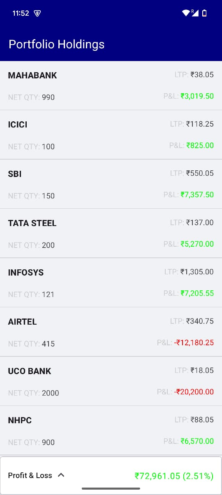
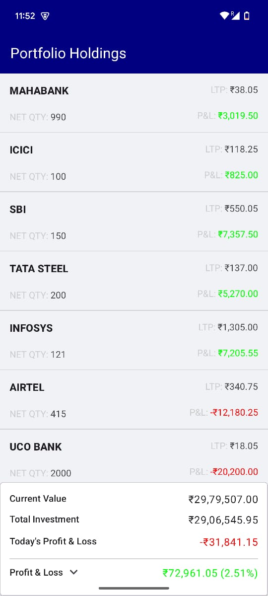

# Stocks Portfolio Android App

A sample Android application built to showcase a modern, modular, and robust app architecture. This app fetches a user's stock portfolio, displays the holdings, and calculates key performance metrics like current value and profit/loss, all while supporting offline caching.

---

## ✨ Features

- **Portfolio Overview**: View a list of all stock holdings.
- **Financial Summary**: An expandable bottom card shows:
    - Total Investment
    - Current Portfolio Value
    - Today's Profit & Loss
    - Total Profit & Loss
- **Offline Support**: The app caches data locally using SQLite, allowing users to view their portfolio even without an internet connection.
- **Clean, Modern UI**: A simple, intuitive user interface built with Material Design components.

---

## 🏗️ Architecture

This project is built using **Clean Architecture** with a strict, modular approach. The code is separated into four distinct modules (`:app`, `:presentation`, `:data`, and `:domain`) to enforce separation of concerns, improve build times, and ensure the codebase is scalable and maintainable.

The architecture strictly follows the **Dependency Rule**, where dependencies only point inwards. This means the UI and Data layers depend on the Domain layer, but the Domain layer is completely independent.


## 🛠️ Tech Stack & Libraries

-   **Language**: [Kotlin](https://kotlinlang.org/)
-   **Asynchronous Programming**: [Kotlin Coroutines](https://kotlinlang.org/docs/coroutines-overview.html) for managing background threads.
-   **Architecture**:
    -   Clean Architecture (Modular)
    -   Model-View-ViewModel (MVVM)
-   **UI**:
    -   Android XML Layouts with ViewBinding
    -   Material Design 3 Components
-   **Networking**:
    -   `HttpURLConnection` (No third-party libraries)
-   **Database**:
    -   Native `SQLiteOpenHelper` for offline caching (No third-party libraries).
-   **Dependency Injection**:
    -   Manual DI using an Application class and ViewModel factories.
-   **Testing**:
    -   **JUnit 4**: The base framework for unit tests.
    -   **MockK**: A powerful mocking library for Kotlin.

---

## 📁 Project Structure

The project is divided into four main modules:


.
├── app/            # Main application module, ties everything together.
├── data/           # Responsible for data sources (API, Database) and repository implementations.
├── domain/         # Core business logic, entities, and use cases. Pure Kotlin module.
└── presentation/   # UI layer (Activity, ViewModel, Adapter, Layout).


---

## 🧪 Testing

The testing strategy focuses on fast, reliable **unit tests** for the layers that contain business and presentation logic.

-   **`:presentation` Layer**: `PortfolioViewModel` is tested to ensure it correctly emits `UiState` objects based on the results from the use case.
-   **`:domain` Layer**:
    -   `GetPortfolioUseCase` is tested to verify it correctly calls the repository.
    -   `Portfolio` entity is tested to ensure the financial calculations (`currentValue`, `profitAndLoss`, etc.) are accurate.
-   **`:data` Layer**: `PortfolioRepositoryImpl` is tested to verify its caching logic and its handling of network success and failure scenarios.

---

## 🚀 Setup and Installation

To get the project up and running, follow these steps:

1.  Clone the repository:
    ```bash
    git clone [https://github.com/your-username/stocks-portfolio-app.git](https://github.com/your-username/stocks-portfolio-app.git)
    ```
2.  Open the project in Android Studio.
3.  Let Gradle sync and build the project.
4.  Run the app on an emulator or a physical device.

---

## 📸 Screenshots

|                    Collapsed                    |                    Expanded                     |
|:-----------------------------------------------:|:-----------------------------------------------:|
|  |  |
|       *Portfolio overview and list view*        |      *Expanded Detailed portfolio summary*      |

---
